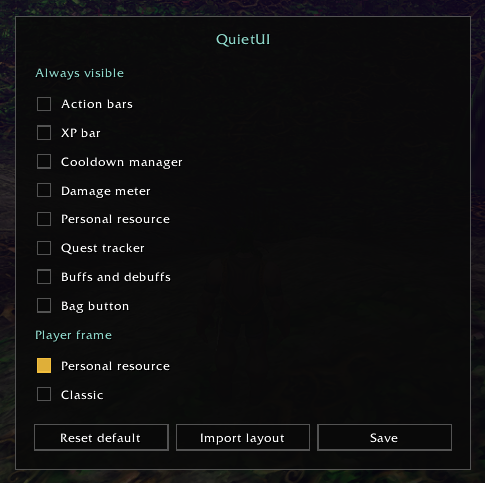

<div align="center">

# QuietUI

**A quiet interface for WoW Forever.**
Few frames. Few buttons. The world stays on screen.


</div>

---

## Why

The default UI shows everything all the time: bars you do not press, a menu you
open twice a week, chat tabs, bag icons, XP. QuietUI hides what you do not
need right now and brings it back the moment you do.

It is either **on** or **off**. One window, `/quiet setup`, chooses what stays
on screen. That choice is saved per character.

## What fades

Checked rows in `/quiet setup` stay visible. Everything else follows this:

| Element | Shows when |
| --- | --- |
| Action bars | hover on that fade group, combat, a vehicle, a dungeon, raid, battleground or arena, Edit Mode. A bar checked Enemy or Friend also shows while you can attack a living target, or while the target is friendly |
| XP bar | hover, Edit Mode, a few seconds after a quest gives XP, an open spell flyout, or an item on the cursor |
| Cooldown manager | combat, a group, an instance, Edit Mode |
| Damage meter | the same as the action bars, and it stays a moment after combat |
| Personal resource | combat, an instance, Edit Mode, or when mana, focus or energy is low. The health part also shows while you are hurt |
| Quest tracker | hover, Edit Mode |
| Buffs and debuffs | hover, combat, a group, an instance, Edit Mode |
| Bag button | hover, while the bag slots are open, or while an item is on the cursor |

Hold `` ` `` to show every row above at once. Letting go follows the same rules, including a checked row. The portrait stays hidden unless the player frame is on, and chat stays as it is. Change the key under QuietUI in Key Bindings; `` ` `` is the default when that key is free.

Hover brings back a whole group, not one bar. Bars 1–3, the stance bar, the pet bar and the totem bar fade together, bars 4–5 fade together, and each later bar fades on its own. The swing timer is group 10. `/quiet setup` changes the number. The same number fades together. Combat, a vehicle, a dungeon, raid, battleground, arena and Edit Mode still show every bar. Enemy and Friend on a bar keep that one bar up for a living attackable target, or a friendly target, including out of combat. The rest of its fade group stays down until hover or one of the rules above.


### Player frame

A checkbox in `/quiet setup`, on by default. The personal resource bar keeps its own rules.

Off, the portrait stays hidden. On, the portrait and your pet show with a target, in combat, in a group, in an instance, in a vehicle, on hover, in Edit Mode, and while `` ` `` is held. A pet on its own does not keep them up.

### One button instead of two rows

The micro menu and all bag buttons collapse into a single small button.

- **Left click** opens your bags.
- **Right click** shows the bag slots, so you can swap bags.
- **Drag** moves it. The position is remembered.


### Modern chat

A toggle in `/quiet setup`, on by default. Uncheck it and the original chat comes back.

Each message is its own rounded bubble. A new line slides in from the left. At the bottom a line fades away after 10 seconds. Scroll up and the older lines are still there. Hover a line to copy it. Channel tags stay short, and the input appears only while you type. **Enter** works as always.


### A layout that fits

QuietUI ships its own Edit Mode layout, also called QuietUI. The first time
you log in, and again if that layout changes, a small prompt asks once:

- **Add** or **Update** puts the layout in place.
- **Not now** leaves your layouts alone.

**Import layout** in `/quiet setup` does the same later, including after Not now.
Turning QuietUI off does not switch your Edit Mode layout.


## Commands

```text
/quiet          turn QuietUI on or off
/quiet setup    open the window
```

## The setup window

`/quiet setup` is the only window. The same choices sit on four tabs: Visible, Bars, Player, and Chat.



**Always visible.** Check a row and that piece stays on screen: action bars,
swing timer, XP bar, cooldown manager, damage meter, personal resource, quest tracker,
buffs and debuffs, bag button. The Action bars check keeps every bar visible. The Swing timer check keeps that bar up on its own.

**Fade together.** Each bar has a number: Bar 1 through Bar 8, the stance bar, the pet bar, the totem bar and the swing timer. The same number fades in together on hover. The default is 1 for bars 1–3, the stance bar, the pet bar and the totem bar, 2 for bars 4–5, then a number of its own for the rest. The swing timer is 10.

**Enemy** and **Friend.** Each bar also has two checks. Enemy keeps that bar up while you can attack your target and that target is alive. Friend keeps it up while the target is friendly. Both can be on. Neither is on by default, and a check does not show the other bars that share its number.

**Player frame.** A checkbox, on by default. On, the portrait and your pet show beside the personal resource bar, as above.

**Chat.** Modern chat is a toggle, on by default. Uncheck it and Save to use the original chat. Fade after sets how long a line stays at the bottom: steps of 5 seconds, up to 60. Stay keeps the line. The default is 10 seconds.

- **Save** keeps the choices and leaves the window open.
- **Reset default** clears the checks, turns the player frame on, puts Modern chat and a 10 second fade back, restores the fade groups, clears Enemy and Friend, and applies that at once.
- **Import layout** writes the QuietUI Edit Mode layout.
- **X** and **Escape** close the window and drop anything you have not saved.

## Install

1. Download the zip from the [latest release](https://github.com/rdurica/quiet-ui/releases/latest).
2. Extract it into `World of Warcraft/_classic_beta_/Interface/AddOns/`.
   The zip already contains the `QuietUI` folder. The folder name has to stay `QuietUI`.
3. Start the game, or type `/reload`, and answer the layout prompt.

## Compatibility

Built for the **WoW Forever** beta.
