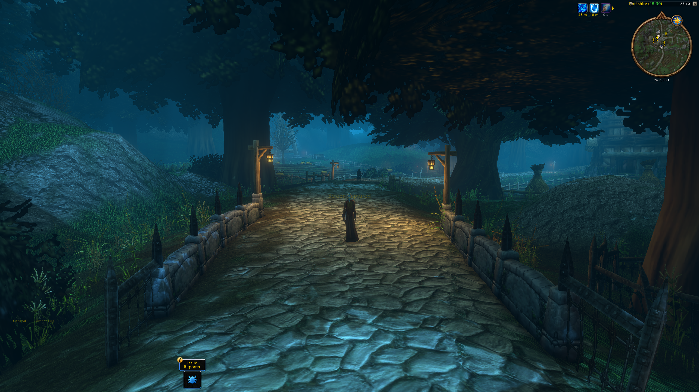
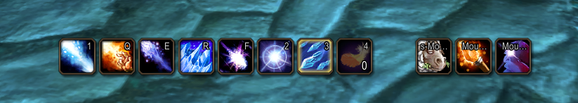
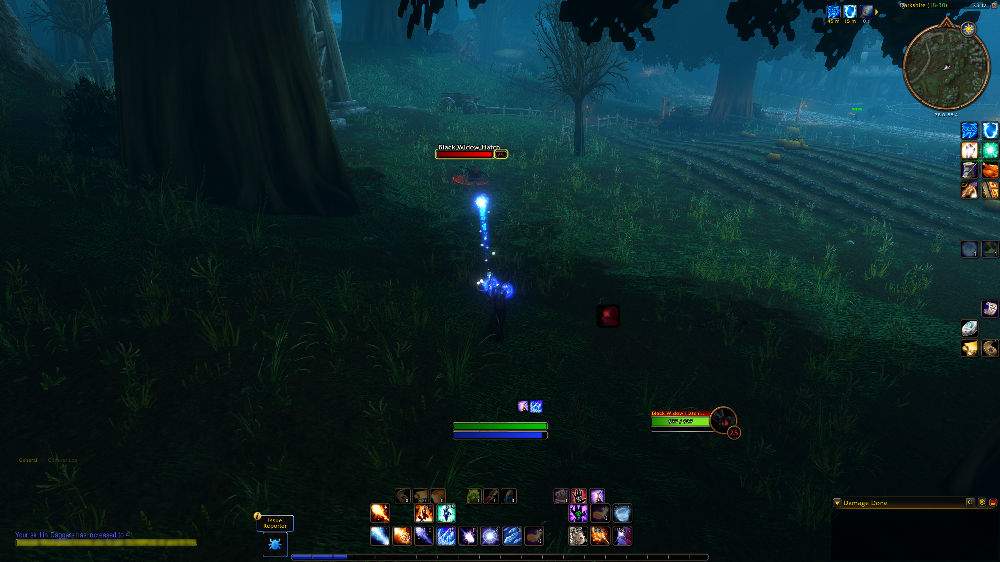
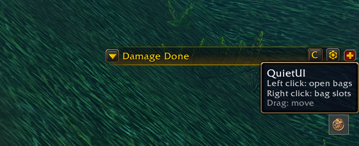
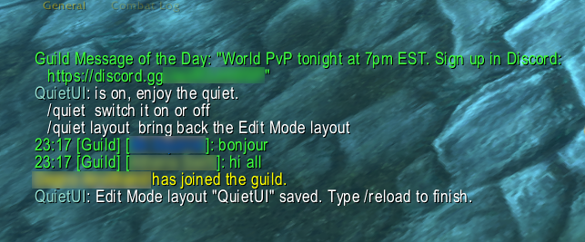
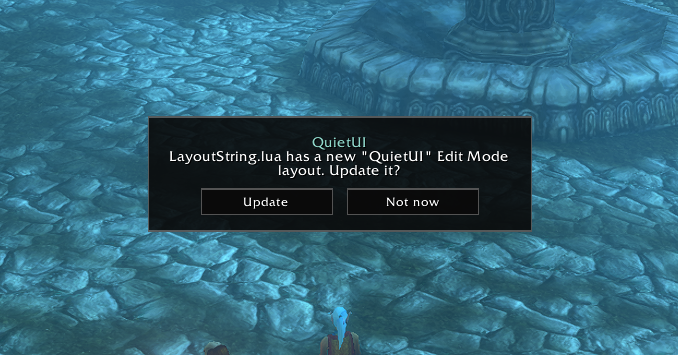

<div align="center">

# QuietUI

**A quiet interface for WoW Forever.**
Few frames. Few buttons. The world stays on screen.



</div>

---

## Why

The default UI shows everything all the time: bars you do not press, a menu you
open twice a week, chat tabs, bag icons, XP. QuietUI hides what you do not
need right now and brings it back the moment you do.

No options panel. No sliders. No profiles. It is either **on** or **off**.

## What it does

### Out of combat, the screen is yours

Action bars and the XP bar fade away. Hover them and they come back. Enter
combat, a vehicle, a dungeon, a raid, a battleground or an arena, and they stay
visible.



### In combat, only what matters

| Element | Shows when |
| --- | --- |
| Action bars, XP bar | hover, combat, vehicle, instance, Edit Mode; XP bar also 5 s after quest XP |
| Cooldown manager | combat, instance, group, Edit Mode |
| Damage meter | combat (+10 s after), instance, group, Edit Mode |
| Personal resource bar | combat, instance, Edit Mode, or mana / focus / energy below 70 %; health bar also while health is not full |
| Player frame | hover, Edit Mode |
| Quest tracker | hover, Edit Mode |



### One button instead of two rows

The micro menu and all bag buttons collapse into a single small button. It
shows only on hover.

- **Left click** opens your bags.
- **Right click** shows the bag slots, so you can swap bags.
- **Drag** moves it anywhere. The position is remembered.



### Chat without the chrome

Chat keeps its text and loses the tab art, buttons and background. The input box
appears only while you type. **Enter** works as always.



### A layout that fits

QuietUI ships its own Edit Mode layout called `QuietUI`. On first login (and
whenever the bundled layout changes) it asks once, in a small flat prompt:

- **Add** / **Update** — create the layout, or refresh it in place.
- **Not now** — nothing changes. Run `/quiet layout` any time later.

Nothing touches your layouts without your consent.



## Commands

```text
/quiet          toggle QuietUI on or off
/quiet on       turn it on
/quiet off      turn it off and restore the default look
/quiet layout   write the bundled Edit Mode layout now
```

`/quiet off` restores every faded frame and hidden texture. It does not switch
your Edit Mode layout.

## Install

1. Download `QuietUI-<version>.zip` from the
   [latest release](https://github.com/rdurica/quiet-ui/releases/latest).
2. Extract it into `World of Warcraft/_classic_beta_/Interface/AddOns/`.
   The zip already contains the `QuietUI` folder.
3. Start the game (or `/reload`) and accept the layout prompt.

Prefer git? Clone straight into the AddOns folder:

```sh
git clone https://github.com/rdurica/quiet-ui.git QuietUI
```

> The folder must be named `QuietUI`, so it matches `QuietUI.toc`.

## Design rules

- **Flat and dark.** Thin borders, one warm highlight.
- **Safe.** Bars change only through alpha. No secure snippets, no
  `StaticPopup`, no `EditModeManagerFrame` calls — nothing that spreads taint.
- **Hands off.** Target, party and raid frames, the minimap, extra action
  buttons and the LFG eye are never hidden.
- **No libraries.** Plain Lua, a few small files.

## Compatibility

Built for the **WoW Forever** beta client (`Interface: 16001`).

